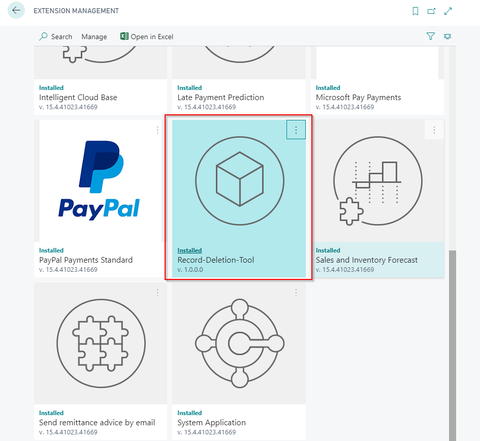
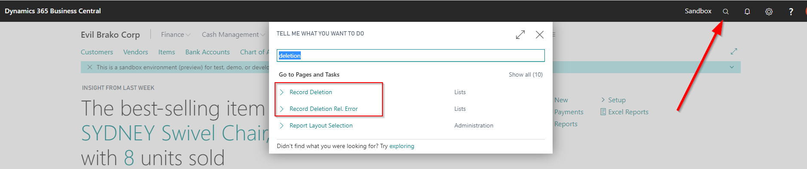

# Record Deletion Tool for Business Central

## Overview
A powerful Business Central AL extension that enables safe bulk deletion of records across multiple tables with built-in relationship validation and comprehensive backup capabilities. Perfect for cleaning up test data, managing demo environments, or performing data maintenance in Business Central.

**⚠️ Important**: For illustration purposes only, without warranty. Use at your own risk. Always test in a non-production environment first.

## Key Features

### 🗑️ Bulk Record Deletion
- Delete records from multiple tables simultaneously
- Organized by functional areas (Finance, Sales, Purchase, Inventory, etc.)
- Support for 200+ standard Business Central tables
- Option to run with or without table triggers

### 🔍 Relationship Validation
- Automatically checks table relationships before deletion
- Identifies records that would cause orphaned data
- Displays validation errors for review before proceeding
- Prevents accidental data integrity issues

### 💾 Comprehensive Backup System
- **Automatic backup prompts** before deletion operations
- **Three backup types**: JSON Export, Snapshot, Full Backup
- **JSON-based storage** for easy portability and inspection
- **One-click restore** to recover deleted data
- **Export/Import** backup files for archival or transfer
- **Backup metadata** tracking (user, date/time, operation type)

### 🎯 Smart Table Suggestions
- Pre-configured suggestions for common deletion scenarios
- Grouped by functional areas:
  - Finance (G/L Entries, VAT, Bank, Fixed Assets)
  - Sales (Orders, Invoices, Shipments, Credit Memos)
  - Purchase (Orders, Invoices, Receipts)
  - Inventory (Item Ledger, Tracking, Journals)
  - Service Management
  - Warehouse Operations
  - Jobs & Time Sheets
  - Manufacturing
  - CRM & Marketing
  - Intercompany & Approvals
- Option to suggest unlicensed partner or custom tables

## Installation

1. Download the latest `.app` file from the releases
2. Install via Business Central Extension Management:
   - Search for "Extension Management" in Tell Me
   - Click "Upload Extension"
   - Select the downloaded `.app` file
3. Grant the "Record Deletion" permission set to users who need access

## How to Use

### Basic Workflow

1. **Open the Record Deletion page**
   - Search "Record Deletion" in Tell Me (Alt+Q)
   - Or navigate via Extension Management

2. **Insert/Update Tables**
   - Click "Insert/Update Tables" to populate the list of available tables
   - This scans your Business Central environment for tables

3. **Suggest Records to Delete**
   - Click "Suggest Records to Delete" for standard BC tables
   - Or "Suggest Unlicensed Partner or Custom Records" for custom tables
   - Review the list and manually check/uncheck the "Delete Records" field

4. **Check Table Relations (Recommended)**
   - Click "Check Table Relations" to validate data integrity
   - Review any errors in the "No. of Table Relation Errors" column
   - Click the number to see detailed error messages
   - Fix issues or proceed with caution

5. **Create Backup (Optional but Recommended)**
   - Navigate to "Table Backup List" page
   - Click "Create Table Backup" to manually backup specific tables
   - Or let the deletion process prompt you automatically

6. **Delete Records**
   - Click "Delete Records (without Trigger)" for faster deletion
   - Or "Delete Records (with Trigger)" to execute table triggers
   - **You will be prompted to create a backup** - highly recommended!
   - Confirm the deletion operation

### Restoring Deleted Data

1. Search "Table Backup List" in Tell Me
2. Find the backup you want to restore (use filters if needed)
3. Click "Restore Backup"
4. Confirm the restoration
5. Records will be re-inserted into the original table

### Managing Backups

- **View Backup Data**: Inspect the JSON content of any backup
- **Export Backup**: Download backup as a JSON file for archival
- **Import Backup**: Upload previously exported backup files
- **Delete Old Backups**: Remove backups you no longer need

## Screenshots

### Main Record Deletion Page

### Tell Me Integration

### Records Overview

## Technical Details

- **Platform**: Business Central v27.0+
- **Target**: Cloud
- **Object ID Range**: 50000-50099
- **Dependencies**: None (uses standard BC base app)

### Components

- **Tables**: Record Deletion, Record Deletion Rel. Error, Table Backup
- **Pages**: Record Deletion, Record Deletion Rel. Error, Table Backup List, Table Backup Card, Create Table Backup
- **Codeunits**: Record Deletion Mgt., Table Backup Mgt.
- **Enums**: Backup Type, Backup Operation Type
- **Permission Set**: Record Deletion (assignable)

## Best Practices

✅ **DO:**
- Always create backups before major deletion operations
- Test in a sandbox or test environment first
- Review table relationship errors before deleting
- Use "Check Table Relations" to validate data integrity
- Keep important backups exported to external storage
- Document why records were deleted (use backup descriptions)

❌ **DON'T:**
- Delete records in production without thorough testing
- Ignore relationship validation errors
- Delete system tables or master data without careful consideration
- Forget to verify restore functionality works before large deletions

## Troubleshooting

**Q: "No tables appear after clicking Insert/Update Tables"**  
A: Ensure you have proper permissions and the extension is fully installed.

**Q: "Table relation errors prevent deletion"**  
A: Review the errors by clicking on the error count. You may need to delete related records first or proceed with caution.

**Q: "Backup restoration fails"**  
A: Check that the table structure hasn't changed since the backup was created. Some records may fail if validation rules have been added.

**Q: "Deletion is very slow"**  
A: Use "Delete Records (without Trigger)" for faster deletion. Triggers can significantly slow down bulk operations.

## Credits

Created in 2020 for Business Central by **Waldemar Brakowski**

### Original Project
This is an enhanced rebuild of the original record deletion tool by **Olof Simren**.  
You can find his explanations for the initial project on his blog:  
http://www.olofsimren.com/record-deletion-tool-for-dynamics-nav-2015/

### Enhancements
- Comprehensive backup/restore system with JSON serialization
- Relationship validation before deletion
- Support for BC Cloud (v27.0+)
- Modern AL patterns and code quality standards
- Enhanced user experience with progress dialogs
- Extensive table coverage across all BC functional areas

## License

Free to use as you want. No warranty provided. Use at your own risk.

## Repository

GitHub: https://github.com/wbrakowski/Record-Deletion-Tool

## Contributing

Issues and pull requests are welcome! Please test thoroughly before submitting changes.

